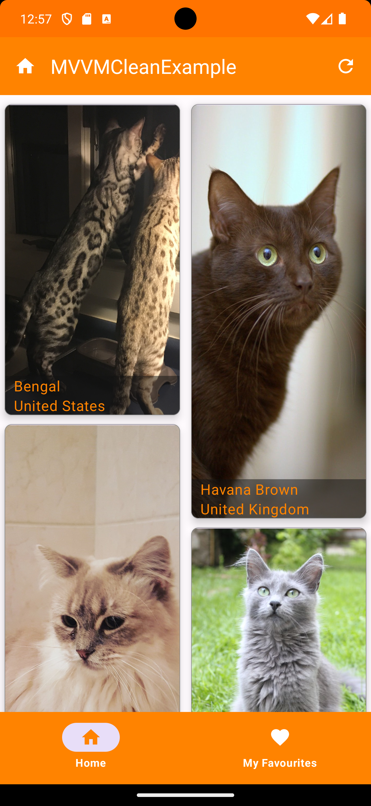
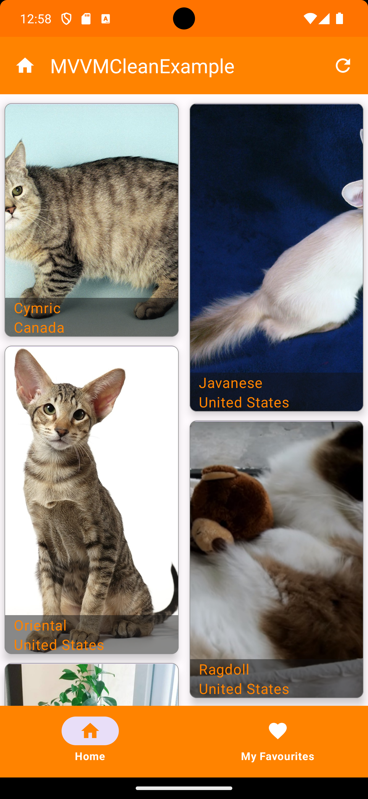
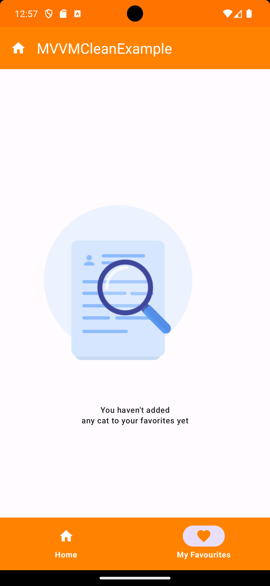
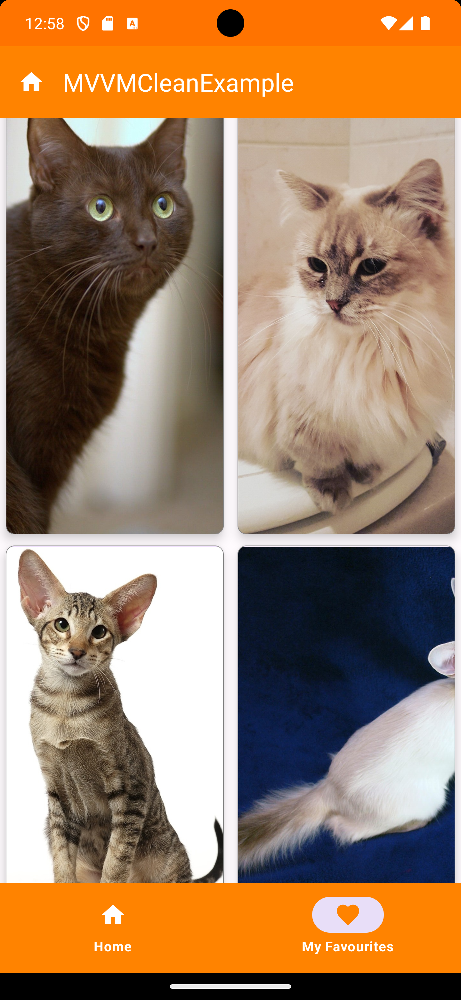

<br />
  <a href="https://github.com/othneildrew/Best-README-Template">
  <h2 align="start">Kotlin MVVM-Clean Architect-JetPack Compose-Example-with- DI-Koin, Coroutines, Retrofit, Room, Solid Principles, DRY Principle, OOPs</h2>

[](https://opensource.org/licenses/Apache-2.0)

[](https://developer.android.com/jetpack/compose)
[](https://insert-koin.io/)
[](http://kotlinlang.org)
[](https://developer.android.com/training/data-storage/room)
[](https://lv.binarybabel.org/catalog/gradle/latest)
[](https://lv.binarybabel.org/catalog/gradle/latest)
[](https://lv.binarybabel.org/catalog/gradle/latest)

<p align="start">








## Table of Contents

* [About the Project](#about-the-project)
* [Architecture](#architecture)
* [Tech stack](#tech-stacks)
* [Features](#features)
* [Unit Testing](#unit-testing)
* [Environment Setup](#environment-setup)
* [Commits Includes](#commits-includes)

# About the Project

Kotlin MVVM-Clean Architect-JetPack Compose-Example-with- DI-Koin is a sample project that presents
a modern approach to Android app development.
The project tries to combine popular Android tools and to demonstrate best development practices by
utilizing up to date tech-stack like Compose, Kotlin Flow and Koin.
The sample app layers its presentation through MVVM Clean Architecture presentation pattern.

## Architecture

* Modern Architecture
  * Single activity architecture (
  with [Navigation component](https://developer.android.com/guide/navigation/navigation-getting-started))
  that defines navigation graphs
  * [MVVM Clean Architecture](https://medium.com/@ami0275/mvvm-clean-architecture-pattern-in-android-with-use-cases-eff7edc2ef76)
  -A reactive and layered architecture.
  * [Android Architecture components](https://developer.android.com/topic/libraries/architecture) ([ViewModel](https://developer.android.com/topic/libraries/architecture/viewmodel), [Navigation](https://developer.android.com/jetpack/androidx/releases/navigation))
  * [Android KTX](https://developer.android.com/kotlin/ktx) - Jetpack Kotlin extensions
* UI
  * [Compose](https://developer.android.com/jetpack/compose) declarative UI framework
  * [Material design](https://material.io/design)

## Why do we need an architecture even when you can make an app without it?

Imagine you've initiated a project without a well-defined architecture, handling all aspects within
the Activity class. This means everything from making API calls, interacting with the database, to
parsing data is being done in one place. Even if you've created separate classes for these tasks,
your Activity class ends up becoming a "god object," responsible for an array of functionalities.

Now, your app is live, and users are actively using it. Suddenly, a new requirement emerges, such as
a need for UI changes. However, your Activity class has become tightly coupled to various functions
like data parsing, API communication, and database interactions. This tight coupling makes altering
the UI a time-consuming and error-prone task. There's a risk of introducing new bugs while making
these changes, and maintaining the codebase becomes challenging.

In essence, without a proper architecture in place, your codebase becomes hard to manage, tracking
down and resolving bugs becomes a daunting task, and reusability of the Activity class is
compromised. Changes to the UI end up inadvertently affecting other functionalities, creating a
maintenance headache.
This is where a well-thought-out architectural approach comes to the rescue.

## Architectue

An architecture is the backbone that empowers your project to be robust, extensible, maintainable,
scalable, reusable, and testable through unit testing. It serves as the organizational structure for
your system, encompassing the decomposition of complex problems or systems into smaller, manageable
parts, their interconnections, interaction protocols, and the fundamental principles and design
choices governing the system's construction. This architectural framework minimizes chaos.
With a well-defined architecture in place, you gain the capability to seamlessly introduce new
features, implement changes, write comprehensive unit test cases, ensure ease of maintenance, and
promote code reusability. In essence, architecture provides the solid foundation that makes these
aspects attainable and manageable.

## How?

It adheres to a set of fundamental principles collectively known as SOLID. These design principles
are techniques employed in the process of designing and writing code, with the aim of enhancing code
maintainability, flexibility, and extensibility.

#### SOLID is an acronym for five design principles that help create maintainable and scalable software:

- Single Responsibility Principle (SRP): A class should have only one reason to change.
- Open-Closed Principle (OCP): Software entities (classes, modules, functions, etc.) should be open
  for extension but closed for modification.
- Liskov Substitution Principle (LSP): Subtypes must be substitutable for their base types without
  altering the correctness of the program.
- Interface Segregation Principle (ISP): Clients should not be forced to depend on interfaces they
  do not use.
- Dependency Inversion Principle (DIP): High-level modules should not depend on low-level modules.
  Both should depend on abstractions.

[MVVM (Model-View-ViewModel) Clean architecture](https://medium.com/@ami0275/mvvm-clean-architecture-pattern-in-android-with-use-cases-eff7edc2ef76)
pattern has been used in the development of this application. The development language of the
application is Kotlin. Clean Architecture is a design approach that separates concerns, promoting
maintainability and testability. Combining MVVM with Clean Architecture helps organize an Android
app into layers like

* Presentation Layer
* Domain Layer
* Data Layer


which making it easier to develop and test.

* Architecture;
  *    [ViewModel](https://developer.android.com/topic/libraries/architecture/viewmodel)
  *    [Koin](https://insert-koin.io/docs/quickstart/android/)
  *    [Navigation](https://developer.android.com/guide/navigation)

## Tech Stacks

- [Kotlin](https://kotlinlang.org/) 100% coverage

- [Compose](https://developer.android.com/jetpack/compose)
  - [Material](https://developer.android.com/jetpack/androidx/releases/compose-material) - Build
  Jetpack Compose UIs with ready to use Material Design Components.
  - [Foundation](https://developer.android.com/jetpack/androidx/releases/compose-foundation) - Write
  Jetpack Compose applications with ready to use building blocks and extend foundation to build your
  own design system pieces.
  - [UI](https://developer.android.com/jetpack/androidx/releases/compose-ui) - Fundamental
  components of compose UI needed to interact with the device, including layout, drawing, and input.
  - [ConstraintLayout](https://developer.android.com/jetpack/androidx/releases/constraintlayout) -
  ConstraintLayout-compose 1.0 provides ConstraintLayout functionalities in Jetpack Compose.
  - [Lifecycle-ViewModel](https://developer.android.com/jetpack/androidx/releases/lifecycle) -
  Perform actions in response to a change in the lifecycle status of another component, such as
  activities and fragments.
  - [Lottie](https://github.com/airbnb/lottie/blob/master/android-compose.md) - Lottie is a mobile
  library for Android and iOS that parses Adobe After Effects animations exported as json with
  Bodymovin and renders them natively on mobile!
    - [Glide](https://bumptech.github.io/glide/int/compose.html) - A fast and efficient image
      loading library for Android focused on smooth scrolling (Google).

- Dependency Injection (DI)
    - [Koin](https://insert-koin.io/docs/quickstart/android/) -Koin provides a easy and efficient
      way to incorporate dependency injection into any Kotlin application.In this project i am using
      Koin but you can
      use [Hilt](https://developer.android.com/training/dependency-injection/hilt-android) and
      Dragger for the same.

- [Jetpack](https://developer.android.com/jetpack)
    - [AndroidX](https://developer.android.com/jetpack/androidx) - Major improvement to the original
      Android [Support Library](https://developer.android.com/topic/libraries/support-library/index),
      which is no longer maintained.
    - [Lifecycle](https://developer.android.com/topic/libraries/architecture/lifecycle) - Perform
      actions in response to a change in the lifecycle status of another component, such as
      activities and fragments.
    - [ViewModel](https://developer.android.com/topic/libraries/architecture/viewmodel) - Designed
      to store and manage UI-related data in a lifecycle conscious way. The ViewModel class allows
      data to survive configuration changes such as screen rotations.
    - [Room](https://developer.android.com/training/data-storage/room) - Provides an abstraction
      layer over SQLite used for offline data caching.
    - [Navigation](https://developer.android.com/guide/navigation) -Navigation refers to the
      interactions that let users navigate across, into, and back out from the different pieces of
      content within your app.

- Others
  -    [Retrofit](https://square.github.io/retrofit/)  for networking
  -    [OkHttp-Logging-Interceptor](https://github.com/square/okhttp/blob/master/okhttp-logging-interceptor/README.md)  -
  Logs HTTP request and response data.
  -    [Flow](https://developer.android.com/kotlin/flow) - Flows are built on top of coroutines and
  can provide multiple values.
  - [Material Design](https://material.io/develop/android/docs/getting-started/) - Build awesome
  beautiful UIs.
  - [Coroutines](https://github.com/Kotlin/kotlinx.coroutines) - Library Support for
  coroutines,provides runBlocking coroutine builder used in tests.
  - [Gson](https://github.com/google/gson) - A modern JSON library for Kotlin and Java.
  *
  Functions([Scope](https://kotlinlang.org/docs/scope-functions.html) ,[Inline](https://kotlinlang.org/docs/inline-functions.html)
  and [infix](https://www.geeksforgeeks.org/kotlin-infix-function-notation/) Functions)

# Features

- Save Favorite Cats: Users have the ability to save their favorite cat images by marking them as
  favorites.
- View Favorite Cats: Users can access a collection of all their saved favorite cat images in one
  place.
- Discover Random Cat Images: The application presents users with random cat images when they open
  it. Users can also view these images in full-screen mode by tapping on any image.
- Add to Favorites: Users can add any cat image to their list of favorites by clicking on a
  heart-shaped button associated with each image.
- Change App Theme: Users have the option to customize the application's visual theme to their
  preference. This includes options for light and dark themes or other theme customizations.

##### *Note*

In this instance, I initially employed a single activity with multiple composables to present cat information to the user and facilitate the addition or removal of cats from the favorites list. Nevertheless, it is feasible to accomplish the same functionality using more than one activity by substituting the navigation scenario of a fullView Composable with a new activity. The compose call is included in this new activity. [You can click on this link to inspect the code for your reference:](https://github.com/Prashant-Chandel/Jetpack-compose-MVVM-Clean_Architect-Example-with-koin)
🙌 Now after that we have two ways to show same flow to user✌️.

## Unit Testing

#### UI (JUnit)

JUnit is used for unit testing of UI components. Tests are written to verify the behavior and
interactions of UI elements and view models. Mocking frameworks may also be used to isolate
components for testing.

#### API (Mockito)

Mockito is used for unit testing the API and network-related components. It allows you to create
mock objects and simulate the behavior of external dependencies to ensure that your API interactions
are tested independently.

## Environment Setup

- First, make sure you have Android ```(Android Studio Giraffe | 2022.3.1 Patch 2)```  version
  installed
- Android Studio's Gradle JDK version should be Java 17.0.6.

### Commits Includes

> [!IMPORTANT]   
> [Commit c2510e7b6b3b29c432974c0ee85ce1b80e587a3b](https://github.com/Prashant-Chandel/MVVM-Clean_Architect-Example-with-koin/commit/c2510e7b6b3b29c432974c0ee85ce1b80e587a3b)

This commit introduces the following major changes:

**Dependency Injection (DI) Implementation:** The commit includes the implementation of Dependency
Injection. This architectural pattern is essential for providing objects with their dependencies,
improving code modularity and testability.

**MVVM Clean Architecture:** The project now adheres to the MVVM Clean Architecture. This
architectural style emphasizes the separation of data, domain logic, and presentation concerns,
resulting in code that is clean and maintainable.

**Unit Testing (JUnit & Mockito):** This commit introduces unit testing using JUnit for UI
components and Mockito for API and network-related components. Unit testing ensures that the
application's code is robust and free from critical issues.

**Koin Use Case Module Update**
the Koin use case module might have been declared as follows:

```
"single" definition, create an object that is persistent with the entire container lifetime (can't be dropped).
 single { GetCatsUseCase(get()) }
```

To ensure compliance with these conditions:

```
 long live components (Services, Data Repository ...) - used by several screens, never dropped
 medium live components (user sessions ...) - used by several screens, must be dropped after an amount of time
 short live components (views) - used by only one screen & must be dropped at the end of the screen
```

Now, the Koin module for use cases is declared in a more scallable manner:

 ```
"factory definition", create a new object each time. Short live. No persistence in the container (can't be shared).
 factory<GetCatsUseCase> { GetCatsUseCaseImpl(get()) }
``` 

While these aspects play a crucial role in scaling an application, there's an opportunity to further
enhance scalability by explicitly defining the scope of the module. This can be achieved through the
use of scoped definitions, where an object is created with persistence tied to the associated
scope's lifetime. This approach ensures a more granular and controlled management of dependencies,
contributing to the overall scalability and maintainability of the application.

```
scope<A> { } is equivalent to scope(named<A>()){ } , but more convenient to write.You can also use a string qualifier like: scope(named("SCOPE_NAME")) { }
1. using string name of scope
scope(named("myScope")) {
        // Define dependencies specific to this scope
        scoped<CatUseCase> { CatUseCaseImpl(get()) }
        
        // Define ViewModel for the scope
        viewModel { CatViewModel(get()) }
    }
2. Anonymous
scope {
        // Define dependencies specific to this anonymous scope
        scoped<CatUseCase> { CatUseCaseImpl(get()) }
        
        // Define ViewModel for the anonymous scope
        viewModel { CatViewModel(get()) }
    }
```

To integrate it into the ViewModel, ensure that your ViewModel implements the KoinComponent. This
allows the ViewModel to leverage Koin's dependency injection features seamlessly.

**SOLID Principles and Kotlin Components:** The code adheres to the SOLID principles, ensuring that
the code base is structured with a focus on Single Responsibility, Open-Closed, Liskov Substitution,
Interface Segregation, and Dependency Inversion principles. Additionally, Kotlin-specific components
and functions are leveraged for efficient and expressive code.

**Thank you**😎

# Licensed

Designed and developed by [Prashant Chandel](Chandela.prashant14@gmail.com)

Licensed under
the [Apache License](https://github.com/Prashant-Chandel/MVVM-Clean_Architect-Example-with-koin/blob/Developer/LICENSE),
Version 2.0 (the "License");
you may not use this file except in compliance with the License.
You may obtain a copy of the License at

```
   http://www.apache.org/licenses/LICENSE-2.0
```

Unless required by applicable law or agreed to in writing, software
distributed under the License is distributed on an "AS IS" BASIS,
WITHOUT WARRANTIES OR CONDITIONS OF ANY KIND, either express or implied.
See the License for the specific language governing permissions and
limitations under the License.


